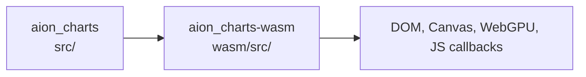
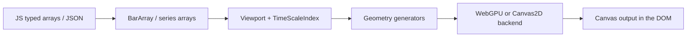
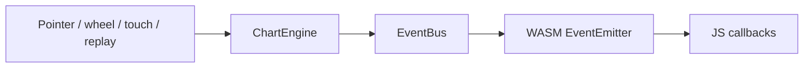
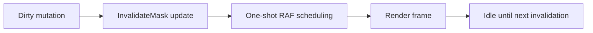

# Architecture

Aion_charts ships as a two-crate system: the core engine is platform-agnostic Rust, and the WASM crate adapts that engine to the browser DOM and JavaScript event model.

## Crate Layout

## Module Responsibility Map

### `src/core/`

- `chart_type`: main-series mode selection and chart-type-specific options.
- `constants`: shared sizing, interaction, and renderer constants.
- `crosshair`: crosshair state, labels, and snapping behavior.
- `data`: columnar OHLCV storage and bar-level validation.
- `demo_data`: sample bar and footprint generators used by demos and tests.
- `drawings`: drawing tools, hit-testing, serialization, and persistence helpers.
- `engine`: chart state orchestration, mutation entry points, and event emission.
- `events`: typed event bus and event-name catalog.
- `execution_marks`: timestamp-based trade annotations and selection state.
- `footprint`: per-price-level footprint data and derived calculations.
- `formatters`: human-readable formatting for price, percentage, and indexed scales.
- `indicators`: indicator compiler, runtime, interpreter, render types, and limits.
- `interaction`: pointer and gesture handling across panes and overlays.
- `invalidate_mask`: dirty-state tracking used by invalidation-driven rendering.
- `kinetic_animation`: glide state and momentum animation timing.
- `markers`: bar-index-based marker storage and rendering metadata.
- `pane`: pane layout, pane IDs, and pane management.
- `price_line`: draggable price-line state and styling.
- `renderer`: geometry generation plus WebGPU and Canvas2D backends.
- `series`: overlay-series definitions, validation, and storage.
- `studies`: built-in studies and study manager plumbing.
- `viewport`: visible-range state, price-scale math, and world-to-screen transforms.

### `wasm/src/`

- `canvas_manager.rs`: browser canvas element wiring and sizing coordination.
- `chart_inner.rs`: shared interior state used by the exported WASM chart object.
- `event_emitter.rs`: JS callback registry and event dispatch bridge.
- `lib.rs`: exported `wasm-bindgen` API surface and option parsing.
- `render_frame.rs`: one-shot RAF render execution and animation follow-through.
- `subpane.rs`: browser-side pane rendering coordination for indicator panes.
- `utils.rs`: JS interop helpers and conversion utilities.
- `workspace.rs`: multi-pane workspace orchestration on the WASM side.

## Data Flow

## Event Flow

## Invalidation Pipeline

## Threading Model

- Rendering, interaction, and DOM work run on the browser main thread today.
- The current engine is intentionally single-threaded at the rendering boundary.
- The reserved off-main-thread seam is the indicator VM, where compiled IR and data frames can be moved to a Worker without changing the public chart API.
- See [indicator-runtime.md](./indicator-runtime.md) for the planned Worker protocol.
